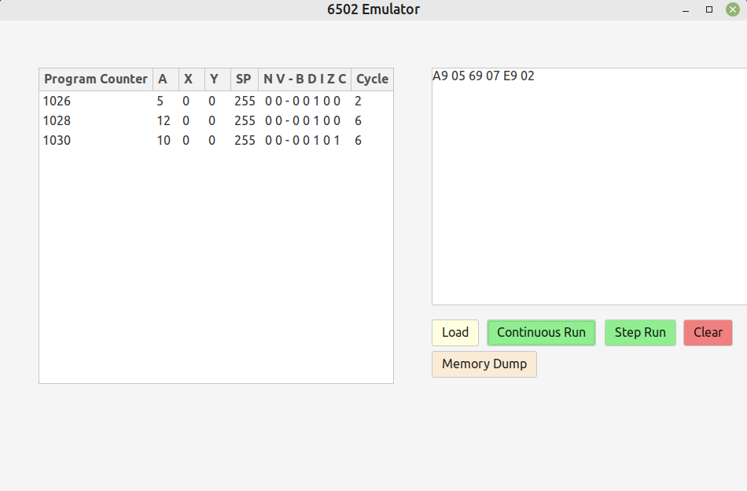

# 6502Emulator
This software emulates the working of the 6502 microprocessor(although the 
functioning and reliability is limited as yet). Input can be given to the emulator
(currently in form of equivalent opcodes of the program), and instruction level execution can
be seen.

This GUI based 6502 emulator was written originally for the mini project requirement of the 3rd semester of
our engineering course.

## Dependencies
* Gtk-3.0

## Build
Once the project repository and Gtk-3.0(the only external library used) are installed properly, 
cmake can be used to generate the executable. 

    $ cd 6502Emulator
    $ cmake ..

An executable will be generated at the [cmake-build-debug](cmake-build-debug)

## How To Run?
This emulator, as of now, depends on third party assemblers to convert the 6502 assembly code into equivalent opcodes. 

Use a third party assembler like [this](https://www.masswerk.at/6502/assembler.html) 
or [this](https://skilldrick.github.io/easy6502/) 
to convert assembly code (example programs are given at [asm_ex](asm_ex)) into equivalent opcode. 
Then simply copy the opcode and paste it into the input window of the emulator, 
and click on the ``Load`` button to load the opcode into the memory. Then use one of the two modes of execution to run 
the program.

There are two modes of execution in the emulator
1. Step Run - runs the program, executing one instruction with each click. 
2. Continuous Run -  executes the whole program on a single click.

``Memory Dump`` button can be used to read the first 512 words of the memory.

``Clear`` button can be used to reset the emulator.

## References
Some references which are useful for learning about the 6502 processor and its emulation are :
* https://www.masswerk.at/6502/6502_instruction_set.html
* https://www.cs.jhu.edu/~phi/csf/slides/lecture-6502-stack.pdf
* http://6502.org/
* https://www.atariarchives.org/2bml/chapter_10.php

## Original Contributors
* [Shobhit](https://github.com/dragon540)
* [Abhishek Raj](https://github.com/abhii-raj)
* [Satyam Govind Rao](https://github.com/ISHADOW007)
